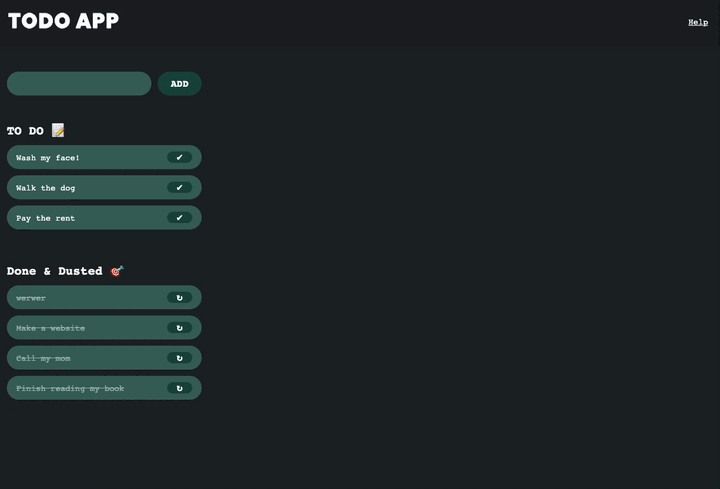

# TODO localStorage

When using local storage you want to do two things.

    useState's initial value should be local storage.getItem

    For any case where an event like a click or typing sets the value of localStorage it should run a function that does both setItem and set state. You probably don't need useEffect to handle this.

# React toDo App

## Task 01 - Hello World

Hier sind wir nun. Unsere Reise mit React hat gerade erst begonnen, und wir sind dabei, den ganzen Sche*ß daraus zu lernen.

**Story**:

Wir werden eine einfache ToDo-App erstellen. Wir werden alle Funktionalitäten von Grund auf neu erstellen, so dass die Benutzer in der Lage sind, neue ToDos hinzuzufügen, ToDos als erledigt zu markieren (und sie in eine separate Liste zu verschieben?) und sie zu löschen.

**ToDo**:

1. Starte ein neues React-Projekt. Ihr könnt `vite` benutzen.
2. Untersuche die Ordnerstruktur und die Javascript-Dateien. Was ist der Einstiegspunkt für unsere App? Was ist dieses seltsame Html namens [JSX](https://react.dev/learn/writing-markup-with-jsx)?
3. Versuchen wir, "Hello World" in unserer App zu zeigen, anstatt der Standardnachricht von Vite.
4. Lasst uns das loswerden, was wir nicht brauchen, wie unbenutzte Bilder.

## Task 02 - Components

Mit [Komponenten](https://react.dev/learn/your-first-component) kannst du die UI (Benutzeroberfläche) in unabhängige, wiederverwendbare Teile aufteilen und jedes Teil für sich betrachten. Vom Konzept her sind Komponenten wie JavaScript-Funktionen. Sie akzeptieren beliebige Eingaben (genannt "props") und geben React-Elemente zurück, die beschreiben, was auf dem Bildschirm erscheinen soll.

Aber wir interessieren uns _noch nicht_ wirklich für Props. In dieser Aufgabe möchten wir unsere App organisieren und unsere Komponenten bauen. Wir werden unsere App entwerfen, sie in Komponenten aufteilen und mit dem Schreiben unserer ersten Komponenten beginnen.

**ToDo**:

1. Erstelle einen Entwurf, wie deine App aussehen soll. Deine App sollte etwas Platz für dein ToDo-Eingabeformular, etwas Platz für die noch nicht fertigen Todos enthalten und etwas Platz für die fertigen ToDos.
2. Setze das Design in Komponenten um.

## Task 03 - Props and State

Wir haben unsere App in verschiedene Komponenten aufgeteilt und nun ist es an der Zeit zu sehen, wie die Daten durch die Komponenten fließen.

Props, kurz für Properties, können am besten als eine Möglichkeit definiert werden, Daten von Komponente zu Komponente weiterzugeben, im Grunde von der Eltern- zur Kindkomponente.

State hingegen speichert Daten über die Komponente, die sich im Laufe der Zeit ändern können. Änderungen können in Form von Benutzerereignissen oder Systemereignissen wie Reaktionen auf Benutzereingaben oder Serveranfragen auftreten. Die Arbeit mit einer State-Komponente umfasst normalerweise das Setzen des Standardzustands einer Komponente, den Zugriff auf den aktuellen Zustand und die Aktualisierung des Zustands.

**ToDo**:
1. Bitte erstelle für jedes ToDo und jedes ToDone / erledigtes ToDo eine eigene Komponente.
2. Verwende props, um die Daten der einzelnen Elemente von der übergeordneten Komponente an die untergeordnete Komponente zu übergeben.
3. Verwende state, um den Anfangszustand deiner Komponente zu definieren.

## Task 04 - Events and Forms

React bietet eine einfache Möglichkeit, Ereignisse/Events zu verwalten. Bereite dich darauf vor, sich von addEventListener zu verabschieden.

Formulare erfordern ebenfalls eine besondere Behandlung. HTML-Formularelemente funktionieren in React ein wenig anders als andere DOM-Elemente, da Formularelemente natürlich einen internen Zustand behalten.

Was wir in dieser Phase sehen werden, ist

- wie man mit Ereignissen umgeht.
- wie man Daten von einem Kind zum Elternteil sendet.
- wie man Eingaben von einem Formular erhält.
- wie wir unseren Zustand aktualisieren und unsere Komponente neu rendern können.

**ToDo**:

1. Füge Event-Listener hinzu, damit wir den Status der einzelnen Elemente umschalten können (ToDo / noch nicht fertig <-> Done / fertig).
2. Nachdem wir uns vergewissert haben, dass die Events so funktionieren, wie sie sollten, müssen wir die Änderung abrufen und die Daten in unserer App.jsx aktualisieren und die gesamte App neu darstellen. Diese Änderung muss also bis zur übergeordneten Komponente durchgereicht werden.
3. Richte das Formular so ein, dass es ein neues ToDo-Element hinzufügen kann.

## To be continued...

Ein Beispiel

## HOW TO WRITE A FCKNG TODO APP

## INPUT

1) `event.target.value` mit useState speichern
      -> in string '' oder array []?!?

2) `button onclick` Logik
      -> Eingabe von <Input/> an <ToDo/> weitergeben 
         (props / destructuring)
      -> input Feld auf leeren String '' zurücksetzen 

## TODO

1)  `Eingabe aus <Input />` 
      -> als <li> anzeigen

2)  `button delete onClick` Logik
      -> Eingabe von <ToDo/> an <Done/>       weitergeben (props / destructuring)
      -> angezeigtes <li> löschen

## DONE

1)  `Eingabe aus <ToDo /> `
      -> als durchgestrichenes <li> anzeigen

2)  `button setBack onClick` Logik
      -> Eingabe von <Done/> an <ToDo/> zurückschicken
          - ist möglich?!?
          - alternativ: Daten in <ToDo/> nicht löschen
            sondern verstecken oder in Arr/Obj speichern
              - trotzdem Problem, dass <Done/> mit <ToDo/> 
                "sprechen" muss

3) `button reallyDelete onClick`                 